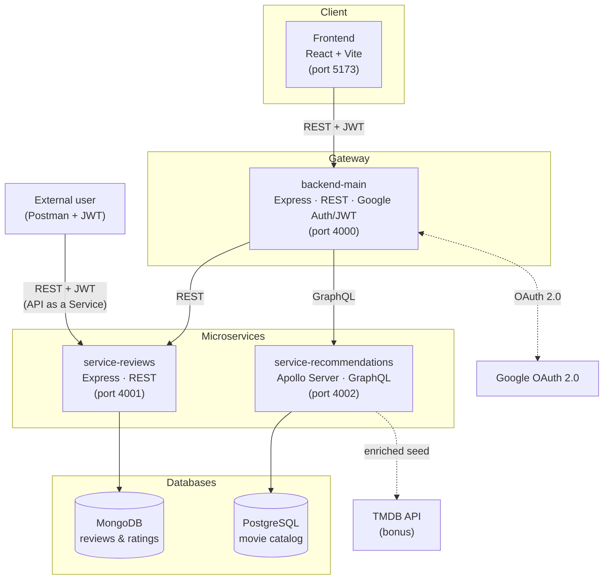

# 🎬 CineMatch

Movie recommendation and review platform — final project for the *API and Web Services* course (M1 Data Engineering / ML, EFREI Paris).

CineMatch lets a user sign in with their Google account, browse a movie catalog enriched via the [TMDB](https://www.themoviedb.org/) API, rate and comment on movies, and get recommendations based on the genre of the movies they view.

---

## Table of contents

- [Architecture](#architecture)
- [Tech stack](#tech-stack)
- [Services and databases](#services-and-databases)
- [API paradigms](#api-paradigms)
- [Authentication](#authentication)
- [Getting started](#getting-started)
- [Environment variables](#environment-variables)
- [API as a Service (Postman demo)](#api-as-a-service-postman-demo)
- [Repository structure](#repository-structure)
- [Team](#team)

---

## Architecture



The frontend **never** talks directly to the microservices: every request goes through `backend-main`, which acts as a *gateway* and orchestrates calls to `service-reviews` and `service-recommendations`. These are two fully independent Node.js projects (each with its own `package.json`, `Dockerfile`, `.env`).

---

## Tech stack

| Layer | Technology |
|---|---|
| Frontend | React 19, Vite, Tailwind CSS v4, React Router |
| Main backend (gateway) | Node.js, Express, Passport.js (Google OAuth 2.0), JWT |
| Reviews microservice | Node.js, Express, Mongoose |
| Recommendations microservice | Node.js, Apollo Server (GraphQL), Prisma ORM |
| Databases | MongoDB 7, PostgreSQL 16 |
| External API (bonus) | TMDB (The Movie Database) |
| Containerization | Docker, Docker Compose |
| CI | GitHub Actions |

---

## Services and databases

| Service | Role | Port | Database |
|---|---|---|---|
| `frontend` | User interface (catalog, movie detail, profile) | 5173 | — |
| `backend-main` | REST gateway, Google authentication, JWT issuance, microservice orchestration | 4000 | — |
| `service-reviews` | CRUD for user reviews/ratings on a movie + dedicated "API as a Service" route | 4001 | MongoDB (`cinematch_reviews`) |
| `service-recommendations` | Movie catalog, search, genre-based recommendation engine (`similarMovies`), TMDB enrichment | 4002 | PostgreSQL (`cinematch_recommendations`) |

The requirements call for at least 3 backend projects (1 main + 2 microservices) and 2 separate databases — both conditions are met above.

---

## API paradigms

CineMatch uses **two distinct API paradigms**:

- **REST** — `backend-main` (gateway) and `service-reviews` (reviews CRUD).
- **GraphQL** — `service-recommendations`, via Apollo Server. The frontend and `backend-main` query this service with GraphQL queries (`movies`, `movie`, `similarMovies`) and a mutation (`createMovie`).

---

## Authentication

1. The user clicks *Continue with Google* in the frontend.
2. They're redirected to `backend-main` (`GET /auth/google`), which delegates to Google via Passport.js.
3. After a successful Google login, `backend-main` receives the OAuth callback, **generates a signed JWT**, and redirects the user back to the frontend with that token.
4. The frontend stores the JWT and automatically attaches it (`Authorization: Bearer <token>` header) to every request to `backend-main`.
5. Protected routes (e.g. posting a review, viewing your profile) verify this JWT through a dedicated middleware. An unauthenticated user trying to access a protected frontend page (e.g. `/profile`) is automatically redirected to `/login`.
6. `service-reviews` shares the **same JWT secret** as `backend-main`, so it can independently verify tokens issued by the gateway without blindly trusting it.

---

## Getting started

Requirements: [Docker](https://www.docker.com/) and Docker Compose.

```bash
git clone https://github.com/DEEfrei/ApiProject.git
cd ApiProject

# Configure shared secrets (JWT, Google OAuth)
cp .env.example .env
# → edit .env with a real JWT_SECRET and your Google Cloud Console credentials

# Start the whole stack (frontend + 3 backends + Mongo + Postgres)
docker compose up --build
```

Once the containers are running:

| Service | URL |
|---|---|
| Frontend | http://localhost:5173 |
| Main backend | http://localhost:4000 |
| service-reviews | http://localhost:4001 |
| service-recommendations (GraphQL) | http://localhost:4002/graphql |

On first launch, the PostgreSQL database is empty: populate the catalog with real TMDB data (posters, synopses, genres):

```bash
docker compose exec service-recommendations npm run seed
```

A Google OAuth account (Client ID + Secret) must be configured in [Google Cloud Console](https://console.cloud.google.com/), with `http://localhost:4000/auth/google/callback` set as an authorized redirect URI, for login to work locally.

---

## Environment variables

Each service has its own `.env` (see the corresponding `.env.example` files):

- **root** (`.env`): `JWT_SECRET`, `GOOGLE_CLIENT_ID`, `GOOGLE_CLIENT_SECRET` — read by `docker-compose.yml`.
- **`backend-main/.env`**: server config, Google OAuth, JWT, microservice URLs.
- **`service-reviews/.env`**: MongoDB connection, `JWT_SECRET` (must match `backend-main`'s exactly).
- **`service-recommendations/.env`**: PostgreSQL connection (`DATABASE_URL`), `TMDB_API_KEY`.

⚠️ `JWT_SECRET` must be **strictly identical** between `backend-main` and `service-reviews`: that's what lets `service-reviews` verify a token it didn't issue itself.

---

## API as a Service (Postman demo)

The project requirements call for an API route, callable by an external user (not just the frontend), secured by JWT — with a demonstration of both a successful call and a rejected one.

This route is exposed by **`service-reviews`**: `GET /api/external/reviews`.

- **With a valid JWT** (`Authorization: Bearer <token>` header) → `200 OK` with the list of reviews.
- **Without a JWT** → `401 Unauthorized` with a clear error message.

The ready-to-use Postman collection (both demo requests) is available at [`docs/CineMatch_API_as_a_Service.postman_collection.json`](docs/CineMatch_API_as_a_Service.postman_collection.json).

To generate a test JWT from `backend-main`:
```bash
docker compose exec backend-main node -e "
const jwt = require('jsonwebtoken');
console.log(jwt.sign(
  { sub: 'test-user', name: 'Test', email: 'test@example.com' },
  process.env.JWT_SECRET,
  { expiresIn: '7d' }
));
"
```

---

## Repository structure

```
ApiProject/
├── frontend/                    → React + Vite, user interface
├── backend-main/                → REST gateway, Google Auth, JWT
├── service-reviews/              → REST + MongoDB, reviews/ratings
├── service-recommendations/      → GraphQL + PostgreSQL, catalog & recommendations
├── docs/                         → Roadmap, project requirements, Postman collection
├── .github/workflows/            → CI (lint/tests on every Pull Request)
├── docker-compose.yml             → Orchestration of all containers
└── .env.example                   → Shared secrets (JWT, Google OAuth)
```

---

## Team

Built as a team of 3 for the *API and Web Services* course:

- **Member 1** — Frontend (React)
- **Member 2** — Main backend, Google/JWT authentication
- **Member 3** — Microservices (`service-reviews`, `service-recommendations`), Docker, TMDB integration, CI/CD
